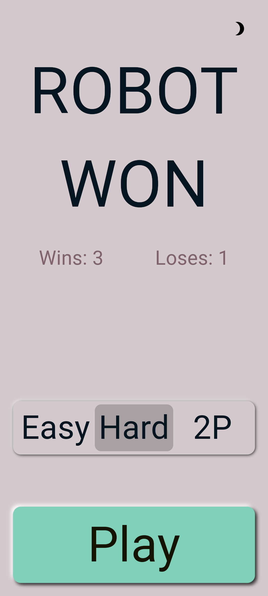
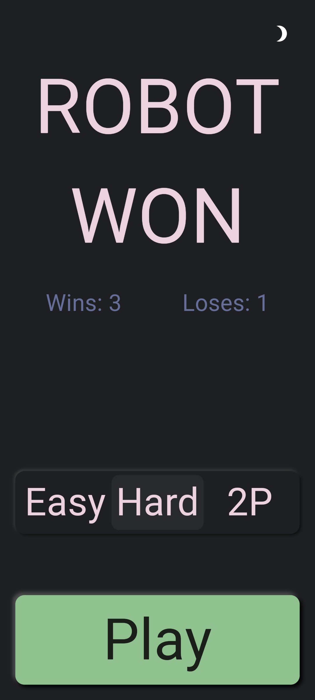
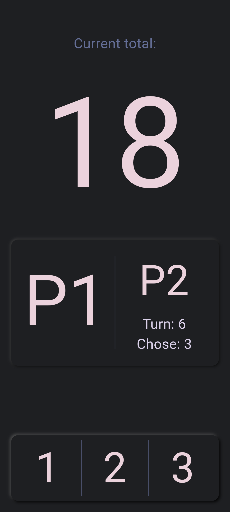
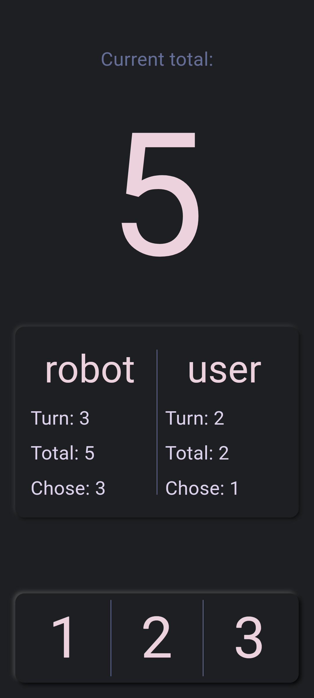

## 21-game-with-ui
This was mostly for practice and assumed I wouldn't need to plan ahead but i was very wrong.. It was made with a neumorphic style. This is also my first flutter app so if anyone has any tips or suggestions as well as any cool resources you use I'd be very grateful for them. The info on how the project is organized is in the main.dart file.

Screenshots:
